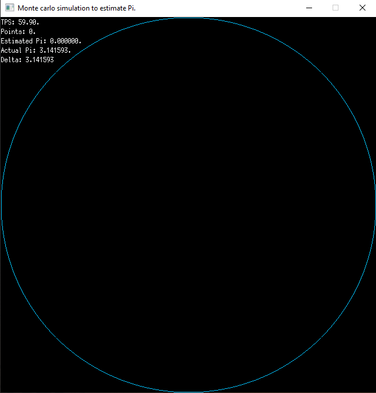

# monte-carlo-pi

A monte carlo simulation written in go that attempts to estimate [Pi](https://golang.org/pkg/math/#pkg-constants). Inspired by [this excellent blog post](https://ggcarvalho.dev/posts/montecarlo/). I'm using [ebiten](https://github.com/hajimehoshi/ebiten) to show the algorithm work visually. When run you will see this:

As you can see, this run achieved a result of 3.140872, which is off by only 0.000721. Due to the nature of monte carlo simulations, different runs will give you different results but I was consistently estimating Pi pretty accurately. Play with the constants at the top (make sure to keep width/height proportionate if you change them) and try running the test again.
